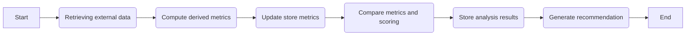

# Stock Analysis Flow 🔍
## Flowchart

## Description
This document represents how the stock analysis works in general
### 1️⃣ Fetch Stock Data

Retrieve Stock Overview & Balance Sheet from AlphaVantage.
Handle API rate limits & cache results to avoid redundant calls.

### 2️⃣ Compute Derived Metrics

Calculate key ratios (Debt-to-Equity, ROE, Current Ratio).
Handle missing values using historical data or industry averages.

### 3️⃣ Update Store Data

Ensure stock exists in DB; add new stocks if necessary.
Perform idempotent updates to avoid duplicates.

### 4️⃣ Compare Metrics & Calculate Scoring

Evaluate against thresholds (static & industry benchmarks).
Assign weighted scores to factors like leverage, profitability, liquidity.

### 5️⃣ Store Analysis Results

Save stock score with timestamp & historical tracking.
Maintain an audit trail for trend analysis.

### 6️⃣ Generate Recommendation

Classify stocks (Strong Buy, Buy, Hold, Sell).
Calculate confidence level based on data stability.
Return structured response with recommendation & score.
