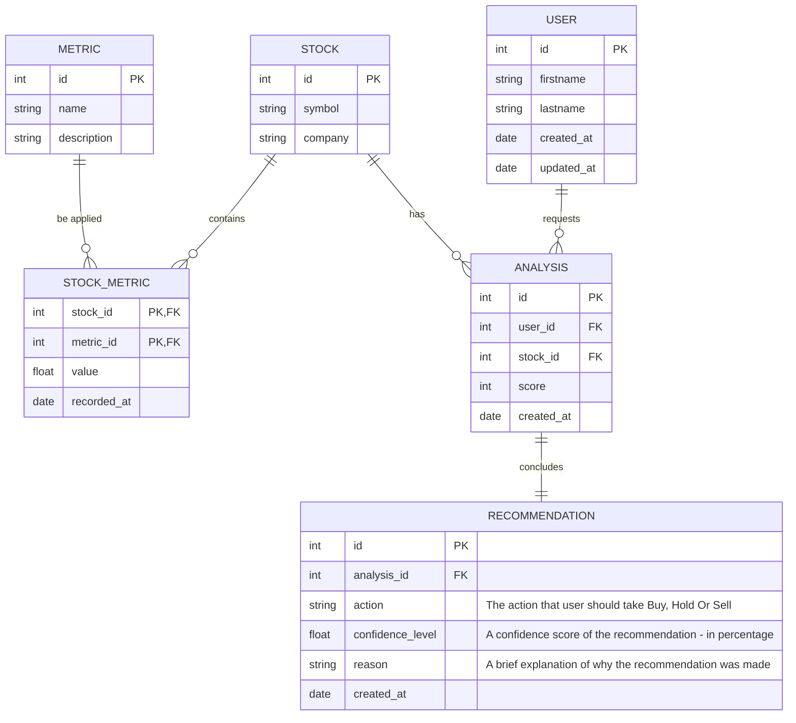

# Entity Relationship 🔗
### Description

A user can request an analysis for many stocks. Each analysis corresponds to a particular stock for a particular user.
A stock can have many metrics associated with it (e.g., P/E ratio, EPS, etc.).
A metric can be shared across multiple stocks.
A stock can have many analyses (for different users or at different times).
An analysis results in a recommendation for a stock.

